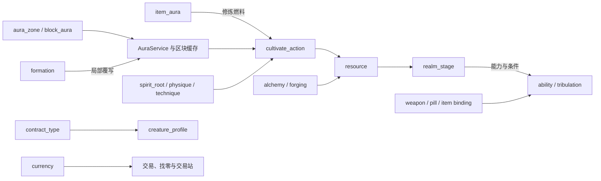

# MiXianTu（觅仙途）

MiXianTu 是一个基于 Minecraft NeoForge 的修仙模组框架，模组 ID 为 `mxt`。它提供可复用的服务端运行时、原版动态数据包注册表、附件、行为与条件分派、数值公式以及
KubeJS 扩展入口；它不预设一套固定的世界观，也不试图把具体门派、境界名称、丹药、武器和配方锁死在本体内。

内容作者可以用数据包定义修炼规则、灵气环境、阵法、技能与经济，再通过 KubeJS、其他模组或本体提供的通用物品承载具体内容。推荐的工作方式是：
**物品和方块由内容包注册，玩法由 MiXianTu 的绑定表与数据表赋予。**

> 项目仍在开发中。数据包 Codec、附件与运行时协议尚未冻结；未发布前不承诺旧存档和旧数据包兼容性。

## 环境与依赖

| 项目         | 当前版本或要求                                                |
|------------|--------------------------------------------------------|
| Minecraft  | `26.1.2`                                               |
| NeoForge   | `26.1.2.92`                                            |
| Java       | `25`                                                   |
| Curios API | 必需依赖，版本范围见 `gradle.properties`；同时通过 Jar-in-Jar 随构建产物分发 |
| KubeJS     | 可选扩展；使用 KubeJS API 或以脚本注册内容时需要安装                       |

## 框架概览

### 数据驱动优先

- **动态数据表**：使用原版 NeoForge 数据包注册表加载，服务端重载时校验，并同步到客户端。当前由 `MxtDatapackRegistries` 注册
  31 个动态表，覆盖资源、修炼、灵气、玩法、世界与经济。
- **固有类型表**：由 Java 注册 `MapCodec`、公式函数、变量、渲染器等实现；数据包通过 `type` 字段选择行为，不能在数据包中自行注入
  Java 行为。
- **原版标签**：动态表停用和分组均使用原版标签系统。每个动态表保留 `mxt:disabled` 标签，标签内的条目不会参与对应玩法。
- **Holder 引用**：跨表引用尽可能在加载阶段解析为 `Holder`；可选引用与列表引用使用容错 Codec，避免运行期重复查询注册表。
- **数值**：数值字段可使用常量、exp4j 表达式或结构化 `NumberProvider`。表达式可从执行上下文读取等级、资源等变量，并通过
  `params` 覆盖或扩展变量。
- **服务端权威**：资源扣除、修炼燃料、境界推进、锻造、炼丹、阵法维护、契约和秘境移动均由服务端结算；客户端只渲染并消费同步后的状态。

### 内容包的典型组合

1. 通过 KubeJS 或其他模组注册物品、方块、配方和世界内容。
2. 用 `item_binding`、`weapon_binding`、`pill_binding`、`technique_binding`、`item_aura`、`currency` 等表把现有物品接入框架。
3. 用 `resource`、`realm_stage`、`cultivate_action`、`ability`、`formation` 等表定义规则。
4. 用原版标签为物品、方块、生物类型和 MiXianTu 动态表分组、筛选或临时停用内容。

## 模块完成情况

状态严格按当前代码闭环判断：

- **完成**：注册表已完成，所有字段已接入，并能形成完整的服务端闭环。
- **制作中**：已完成大部分注册表和字段接入，但仍缺少闭环所需的消费者、入口或跨模块联动。
- **预留**：只有部分数据结构、类型分派或资源，主要逻辑尚未写入。

| 模块        | 状态  | 主要内容                                                                             |
|-----------|-----|----------------------------------------------------------------------------------|
| 资源与资源条    | 完成  | `resource` 支持上下限、再生、修为与蓝条双向转换、内联 `bars`；内置 `mxt:boss_bar` 渲染器、锚点和排序。             |
| 境界与修炼     | 制作中 | `realm_stage` 和 `cultivate_action` 已闭环；`cultivation_technique` 的等级/展示扩展仍缺少统一消费者。 |
| 灵根、体质与称号  | 制作中 | 核心授予和属性已接入；元素灵气类型、灵根兼容/稀有度、体质稀有度、称号等级与自动解锁仍未形成完整闭环。                              |
| 技能、行为与条件  | 制作中 | 事件、资源、公式、冷却和被动属性已接入；技能元素亲和等扩展字段仍缺少统一运行时消费者。                                      |
| 诅咒与天劫     | 完成  | `curse` 有附件、调度器、行为与战利品函数接入；`tribulation` 支持分阶段突破结算。                              |
| 灵气环境      | 制作中 | `aura_zone`、`block_aura`、`item_aura` 的查询、缓存和燃料闭环已完成；灵植增益、炼丹环境开关和自然灵植生成等规则仍待消费者。  |
| 阵法        | 完成  | `formation` 支持结构校验、激活/周期/失效行为、范围实体行为、维护资源与局部灵气覆写。                                |
| 锻造        | 完成  | `forging_method` 和 `forging_blueprint` 支持锻打偏移、成功区间、末 1-6 步匹配、最优步数与品质结算。          |
| 炼丹、灵植与品质  | 制作中 | `alchemy_recipe` 已有工作台闭环；灵植生长/掉落生命周期和品质的价值、锻造、炼丹修正仍缺少完整消费者。                      |
| 法器与数据物品绑定 | 制作中 | 法器存储、飞行和能力已接入；`item_archetype` 的类型扩展、精炼内容以及四种物品绑定的内容闭环仍在完善。                      |
| 生物与契约     | 制作中 | 契约生命周期已闭环；`creature_profile` 的境界、契约标签和部分生成档案字段尚未完整接入。                            |
| 秘境与运行时维度  | 制作中 | `realm_instance` 已负责进入、返回、人数和时长规则；运行时维度加载器尚未自动接管秘境实例。                            |
| 宗门与经济     | 完成  | `sect` 提供成员、贡献、职级、任务、兑换和领地服务；`currency` 支持物品或物品标签货币、找零、交易站和提示。                   |
| 徽章        | 预留  | `badge` 与 `badge_type` 支持空、贴图、提示、按键和配方徽章；当前不主动绑定选择界面或图鉴。                         |
| 通用物品      | 制作中 | 本体提供灵石、灵铁、灵木、空白载体、契约卷轴、御兽铃、灵兽袋、阵盘、秘境令牌、灵力容器、鉴定镜、令牌与制符材料；部分物品仍等待对应数据闭环。        |

完整的逐模块依据、测试覆盖与遗留边界见 [模块实现审计](docs/模块实现审计.md)。

## 系统联动



- **灵气到修炼**：`AuraService` 汇总世界模板、方块贡献和阵法临时区域；修炼行为读取结果，灵根和元素关系再修正效率。`item_aura`
  会在修炼时作为类似熔炉燃料的隐藏值补充灵气。
- **修为到蓝条**：资源可同时保存修为计数与可消耗资源条。修炼状态下可以按配置把资源条转换为修为，其他情况下可反向提取修为补充资源条，两个方向的倍率与单刻源消耗上限独立配置。
- **阵法到环境**：阵法通过结构和维护资源验证后运行，可在范围内执行实体行为，并创建高优先级的临时灵气覆写。
- **物品到玩法**：框架不以动态表创建新物品。绑定表统一匹配已注册物品或原版物品标签，使
  KubeJS、原版和其他模组物品都能接入武器、丹药、功法、资源、货币与灵气燃料玩法。
- **服务端到客户端**：动态表使用原版同步注册表；资源、灵气状态和必要的界面状态通过网络同步。客户端 HUD、雾效和粒子只作为显示层，不决定规则结果。

## 数据包与扩展

动态表文件路径统一为：

```text
data/<命名空间>/mxt/<注册表名>/<路径>.json
```

例如 `data/example/mxt/ability/fireball.json` 对应定义 ID `example:fireball`。动态表标签遵循原版路径：

```text
data/<命名空间>/tags/mxt/<注册表名>/<标签路径>.json
```

停用条目时使用固定标签：

```text
data/mxt/tags/mxt/<注册表名>/disabled.json
```

不要依赖标签 `values` 的顺序，`mxt:item_quality` 的 `mxt:tooltip_order` 是由品质读取接口显式支持的例外。物品和方块匹配字段通常允许单个
ID、单个标签或二者混合的数组；完整字段和限制以 Codec 文档为准。

| 文档                                | 内容                                                                        |
|-----------------------------------|---------------------------------------------------------------------------|
| [数据包格式](docs/数据包格式.md)            | 全部动态表、固有类型分派、数值提供器、标签和内联资源条格式。                                            |
| [灵气环境数据包](docs/灵气环境数据包.md)        | `aura_zone`、`block_aura` 与灵气同步/显示说明。                                      |
| [物品灵气数据包](docs/物品灵气数据包.md)        | `item_aura` 的燃料、返还物品和耗尽行为格式。                                              |
| [物品绑定](docs/item-bindings.md)     | `item_binding`、`weapon_binding`、`pill_binding` 和 `technique_binding` 的字段。 |
| [经济系统数据包格式](docs/经济系统数据包格式.md)    | 货币、兑换、找零与交易站数据。                                                           |
| [KubeJS 物品示例](docs/kubejs物品示例.md) | 用 KubeJS 注册内容物品，再交给绑定表处理的示例。                                              |
| [通用物品](docs/通用物品.md)              | 本体通用物品、组件和预留内容的清单。                                                        |

## 测试与开发

测试模组位于 `src/test-mod`，使用独立的 `mxt_test` 模组 ID，并与主源码集同时加载，不会打入正式 `mxt`
Jar。它包含动态表的最小定义与服务器启动审计。

```text
gradlew runTestClient
gradlew runTestServer
```

`runTestClient` 用于手动进入游戏验证客户端显示和交互；`runTestServer` 用于验证数据包、附件和服务端运行时。JUnit 源码集未用于本项目。

## 兼容与参考

- **KubeJS**：用于创建具体物品、方块、配方与内容数据；MiXianTu 只读取这些已注册对象并通过数据表赋予行为。
- **Curios API**：作为必需依赖，为饰品和法器扩展提供槽位基础。
- **Minecraft / NeoForge**：复用原版物品、方块、实体、维度、粒子、数据组件、标签、战利品与动态注册表机制。
- **Origins-NeoForge**：行为、条件、Modifier、资源条和 Badge 的组织方式参考其数据驱动模型；本项目的动态表仍使用 NeoForge
  原生数据包注册表。
- **RandomEconomy、ResourceWorld**：经济库存处理和运行时维度能力参考相应项目的实现方式，并在本项目的运行时服务中重新组织。

## 授权与第三方协议

本项目当前在 `gradle.properties` 中声明为 **All Rights Reserved**
，尚未发布开放源代码许可证。除非获得作者明确许可，不得重新发布本项目、其修改版本或将其作为其他模组的再发行包，也不得将其中资源用于商业分发。

NeoForge、Minecraft 映射、Curios API、Jupiter、exp4j、KubeJS 以及参考项目的代码和资源均分别遵循其原有许可证或使用条款。分发整合包、二次开发产物或包含
Jar-in-Jar 依赖的构建产物时，需同时满足这些第三方条款及相应的版权声明。
