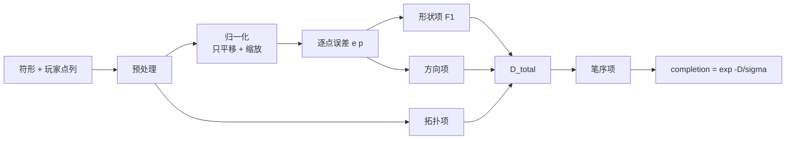

## 定位

画符工作站把一份**符方**（原版配方类型 `mxt:talisman_drawing`）的符形展示给玩家，玩家用符笔在纸面上誊写，服务端拿**已对账过的点列**算出一个 `0~1` 的**完成度**。完成度同时是三件事：

1. 决定这次绘制**成不成**（有没有命中 `result.grades` 里任何一档）；
2. 决定**命中哪一档**，也就是品质 / 耐久 / 灌注 / 额外产物；
3. 作为**公式变量 `percentage`**（就是完成度本身，`0~1`，没有第二层映射）喂给产物公式。

字段口径与配方示例见 [`数据包格式.md`](数据包格式.md) 的 `mxt:talisman_drawing` 一节；本文只讲"这个数是怎么算出来的、怎么调、边界在哪"。

## 完成状态

| 部分 | 状态 |
| --- | --- |
| 判分算法 `runtime/talisman/TalismanDrawingScorer`（纯函数，服务端与客户端预览共用同一份） | 已实现 |
| 服务端会话与结算（开画取纸、逐笔扣颜料、提交对账、判档产出、取消退款） | 已实现 |
| 算法腿 `/mxt_test talisman`（固定输入 + 区间断言） | 已实现，专用服务端实跑通过 |
| 会话腿 `/mxt_test drawing`（无头跑完整条会话与结算） | 已实现，专用服务端 **40/40 OK** |
| 界面上真人鼠标绘制的实机流程 | **制作中**：真人手测已修掉三处——列表不重推所以选不了符方、墨迹层每点清屏所以纸面在抽、退款按"开画前的整摞"退还所以换符方能刷符纸；鼠标采集本身**只在已删除的自动探针里**出过问题，真人手感与 GUI scale 下的坐标仍待手测 |
| 各项数值的**实测标定**（下面的数字是先给一套能跑的初值） | **预留** |

## 输入与参数

| 来源 | 字段 | 缺省 | 说明 |
| --- | --- | --- | --- |
| 配方 `pattern` | `tolerance` | `0.06` | 容差，**画布高度的比例**：`tol_px = tolerance × 210`（`0.06 → 12.6px`）；同时喂 RDP 阈值与"闭合笔"判据 |
| 配方 `judgement` | `sigma` | `1.0` | 完成度映射的宽容度（唯一的手感总旋钮） |
| 配方 `judgement` | `direction_weight` / `topology_weight` / `order_weight` | 各 `0.25` | 三个辅助项的权重；形状项固定 `1.0`、没有字段 |
| 配方 `judgement` | `min_stroke_length` | `0.02` | 短笔门槛，画布高度比例（`≈4px`） |
| 配方 `judgement` | `stroke_count_strict` | `false` | 笔数不等时是否直接让笔序项判满 |
| 配方 `judgement` | `preview` | `true` | 客户端是否算本地预览（判分器不读它） |
| **代码常量** | `RESAMPLE_STEP` | `2.0`（像素） | 重采样弧长步长；**不是配方字段**，写了会被静默忽略（未知键不报错） |
| **代码常量** | `SIMPLIFY_EPSILON` | `0.5`（× 容差） | RDP 简化阈值系数；同上 |
| **代码常量** | 画布 `90 × 210` | 固定 | `pattern.strokes` 的 `[u, v]` 是归一化坐标，按它换算成像素 |

## 算法

七步（实现以 `TalismanDrawingScorer` 为准）：

0. **退化输入**：玩家总点数 `< 2`、或丢掉短笔后总弧长 `< min_stroke_length × 高` → `completion = 0`（不抛异常、不记错误日志，这是"还没画完就提交"的正常情况）。
1. **预处理**（参考与玩家同一套）：① 丢弃与上一保留点距离 `< 1px` 的点；② 丢掉短于门槛的整笔；③ 每笔按弧长等距重采样到 `clamp(round(长度px / RESAMPLE_STEP), 16, 256)` 个点（**快慢不影响判分**）；④ RDP 简化（阈值 `SIMPLIFY_EPSILON × tol_px`）找角点，首尾距离 `< 2 × tol_px` 记为**闭合笔**；⑤ 线段两两求交并切分（拓扑项要数交点数）。
2. **归一化**：各自平移到质心、再除以到质心的 RMS 距离（两边都变成"尺寸 1"）。**只做平移与缩放，不做旋转**——符箓有正倒，转过来要扣分。容差跟着换算：`tol_norm = tol_px / rms_ref`（参考侧预计算）。玩家点云 RMS `≤ 1e-6` → `completion = 0`。
3. **逐点误差**：`e(p) = min(1, (d' / tol_norm)²)`，`d'` 是到对方**最近线段**的距离（不是到最近采样点，否则笔的快慢会改变分数）。平方让"贴着画"与"擦着容差画"拉开距离。
4. **四项距离**：
   - 覆盖 `C = 1 - mean_参考 e(·, 玩家)`（符形被盖住的程度）
   - 精确 `P = 1 - mean_玩家 e(·, 参考)`（墨迹落在符形上的程度）
   - 形状 `D_shape = 1 - 2CP/(C+P)`（**F1**，`C + P = 0` 时取 0）
   - 方向 `D_dir`：参考点切线 vs 它在玩家笔画上最近点的切线，夹角折到 `[0, π/2]` 再除以 `π/2`，按 `1 - e(p)` 加权平均（离得远的点没有方向可言，不参与）
   - 拓扑 `D_topo`：五项计数逐项软化后加权——笔画数（松弛 0）、端点数（松弛 1）、交点数（松弛 1）、闭合区域数（欧拉公式，松弛 1）、总长度（5%），权重 `0.15 / 0.25 / 0.25 / 0.25 / 0.10`，每项 `max(0, |a-b| - slack) / max(a, b, 1)`
5. **笔序** `D_order`：**按形状配对**，不按先后——先对每一对（参考某笔，玩家某笔）算双向 F1，再贪心挑出最好的若干对（每笔只用一次），取这些对的平均；笔数不等时再乘 `min(n,m)/max(n,m)`；`stroke_count_strict: true` 且笔数不等 → 直接判满。**"第几笔画"不上屏**（参考层只在 `pattern.show_order` 为真时才画笔序号），所以同样的几笔换个顺序画不该扣分；笔数不等（少画一笔、多画一笔、半途抬笔把一笔拆成两笔）照旧扣。
6. **总距离与完成度**：`D_total = D_shape + 0.25·D_dir + 0.25·D_topo + 0.25·D_order`（系数就是上面三个权重），`completion = clamp(exp(-D_total / sigma), 0, 1)`。
7. **输出**：完成度 + 各分量 + 简化后的关键点数 / 是否闭合 / 是否退化（调试与探针用；客户端预览只取完成度）。

## 为什么这么设计

| 选择 | 理由 |
| --- | --- |
| 贴合用 **F1** 而不是 `(C+P)/2` | 算术平均对"整张乱涂"太宽容：乱涂的 `C` 高、`P` 低，平均下来还能有 0.48；F1 对两个方向的失衡敏感，同一组输入掉到 0.39 |
| 方向项按 `1 - e(p)` 加权 | 离参考很远的点，切线方向没有意义，不该参与打分 |
| **平移与缩放归一化，旋转不归一化** | 画在纸的哪一处、画多大都不该判（誊写不是临摹构图）；转过来则是"画歪了"，要扣分 |
| 容差是**画布高度的比例** | 归一化之后两边都是"尺寸 1"，容差换算成 `tol_norm` 后与画布开多大无关；算分不碰画布像素数 |
| 完成度用 `exp(-D/σ)` | `D` 是无量纲的"贴合距离"（各项都在 `[0,1]`），指数映射让"接近"区间的区分度更细；`sigma` 就是那个宽容度旋钮 |
| 笔序项**按形状配对**，不按先后 | 参考层不显示笔序号，玩家看不见"第几笔"；按先后配对会让"同样三笔、换个顺序"从 `0.93` 掉到 `0.80`，而那两幅画看起来一模一样。笔数不等仍然照扣 |
| 交点数 / 闭合区域数**允许 ±1** | 容差是 `12.6px`，手抖让一条线"擦到"另一条还是"差几像素没到"本就是掷硬币；形状项已经判过线在不在该在的地方，再按图论数一次等于罚两遍（实测：一条稍带弧度的忠实描红会因此丢一个交点，白扣 `0.12`） |

## 实测数字（探针腿，不是手测）

`/mxt_test talisman` 在专用服务端上跑固定输入（三笔示例符形）得到的完成度：

| 画法 | 实测 | 说明 |
| --- | --- | --- |
| 完美复刻 | `0.999` | 最高档（示例写到 `0.88`）可达 |
| 抖动 ±2px | `0.961` | 仍然很高：贴合项对 2px 不敏感（容差 12.6px） |
| **手描（2px 抖动 + 3px 弧 + 两端各出头 8px）** | `0.933` | 一份"认真描"的合成手迹：`shape 0.979`，丢分主要在方向项 |
| 同上，**换个笔画顺序** | `0.933` | 与上一行**完全相同**（笔序项按形状配对） |
| 同上，**半途抬笔把一笔拆成两笔** | `0.857` | 笔数不等照旧扣，但不再致命 |
| 手糙一点（5px 抖动 / 6px 弧 / 出头 16px） | `0.815` | `shape 0.933`、`topology 0.248` |
| 整体转 15° | `0.545` | 明显掉下来——旋转不归一化是有意的 |
| 整体转 90° | `0.239` | **不是 0**：默认权重下 `D_total` 上限约 `1.75`，完成度下限本来就 ≈`0.17` |
| 整体平移 / 放大 2× | `0.998` / `0.998` | 与完美复刻差 ≤ 0.002（平移缩放不判） |
| 缩小到 0.5× | `0.934` | **已知偏差**：RDP 阈值与闭合笔判据是绝对像素，半尺寸图里缓弯会被误判成闭合笔 |
| 缺一笔 | `0.818` | 覆盖掉，笔数不等再扣 |
| 多一笔 | `0.677` | 精确掉，笔数不等也扣 |
| 整张乱涂 | `0.398` | F1 把 `P` 的塌陷放大 |
| 空 / 单点 / 全 NaN | `0` | 退化输入 |

**这是一套几何推算的初值，不是手感标定结果**：`sigma`、`tolerance`、三个权重、`min_stroke_length` 与两个常量还没在真人手上标定过。上面那几行"手描"是**合成的**（确定性的抖动+弧度+出头），用来把"人画的样子"和"几何项各扣多少"对上账，替代不了真人试笔。

## 作者怎么调

| 想做的事 | 动哪个 |
| --- | --- |
| 整体松一点 / 紧一点 | `judgement.sigma`（唯一的总旋钮：`D_total = 1` 大约是"少画三笔中的一笔"，映射成 `0.37`） |
| 容差宽严（"离多远算画歪"） | `pattern.tolerance`（画布高度比例，缺省 `0.06`） |
| 更看重笔顺 / 形状 / 拓扑 | `order_weight` / `direction_weight` / `topology_weight`（形状项固定 `1.0`，是主项） |
| 严苛到"笔数必须对" | `judgement.stroke_count_strict: true` |
| 判档线 | `result.grades[].min_completion`（照上面的分布写；最低档就是及格线，全部不命中 → 失败） |
| **别动** | `RESAMPLE_STEP` / `SIMPLIFY_EPSILON` / 画布尺寸——它们是代码常量，写进配方会被静默忽略 |

## 服务端权威与对账

- **逐笔上报、服务端扣费**：笔画只在客户端累积，但每收笔发一笔；服务端自己量这一笔的长度并从**光标上那支符笔**里扣颜料（客户端报上来的长度与用量一律不读）。
- **时间检测**：相邻两笔之间、以及"开画 → 第一笔"之间的间隔必须 ≥ 服务端配置的**最小落笔间隔**（缺省 300ms，`0` 关闭），判定只看服务端收到包时的游戏刻；不足的那一笔**拒收**，客户端必须把那一笔抹掉。被拒笔数超过上限 → 本次会话判失败。
- **最终对账**：提交时把整幅图案再发一次，服务端与逐笔记录**逐点比对**——多一笔、少一笔、坐标变了、顺序变了，都算不一致 → 判失败（材料不退）并记一条 warn。
- **它拦得住什么**：拦"一瞬间灌进来几百笔"（脚本、改包）。**拦不住**"按 0.3 秒节奏自动描图"的脚本——那种脚本画得就是准。别把它当成万无一失的防作弊。

## 排错

| 现象 | 先看什么 |
| --- | --- |
| 配方加载期报错 | `talisman` 写错 id（`Failed to get element …`）、`strokes` 空或点不在 `[0,1]²`、`grades` 不唯一升序、消费公式里写了不认识的变量名 |
| 画出来永远是 0 | 是否退化输入（点数 `< 2`、总弧长太短）；`min_stroke_length` 是不是太大；符形点云是不是所有点重合（加载期会拒） |
| 分数普遍偏低 | 先怀疑 `tolerance` 太小、`sigma` 太小，或符形本身笔画太密（拓扑项与方向项都吃笔画数） |
| 列表整片灰掉 | 界面那一格里没有符纸、**那张纸不满足这一行的 `paper`**（例如要求"至少某档"而纸没有档，见 [`数据包格式.md`](数据包格式.md) 的 `mxt:talisman_drawing` 一节），或配方 `costs` 里的额外项付不出（**笔不参与这个判断**：颜料是逐笔扣的，没笔时列表照样能选，落笔才会被拦下并提示） |
| 某一笔被拒 | 三种原因分得很清楚：过快（间隔）、颜料不够（笔上余额）、笔不在光标上了（换手/放进格子）；被拒就抹掉那一笔，否则提交对账必挂 |
| 选完符方还有纸的顾虑 | 落笔之前点另一行就是换符方：当前那个没画过的会话会被结算掉、纸原样放回，**免费**；落笔之后才固定 |
| 槽里的符纸越换越少、背包里越来越多 | 退款只退**实际扣走的那一份**（开画前后按槽量出来的差额），不是开画前槽里的整摞；`TalismanDrawingSession.chargedItems` 记的就是它 |

探针与实机验证的现状见 [`../research/66_画符工作站设计.md`](../research/66_画符工作站设计.md) 的 §13.2 / §13.3。
