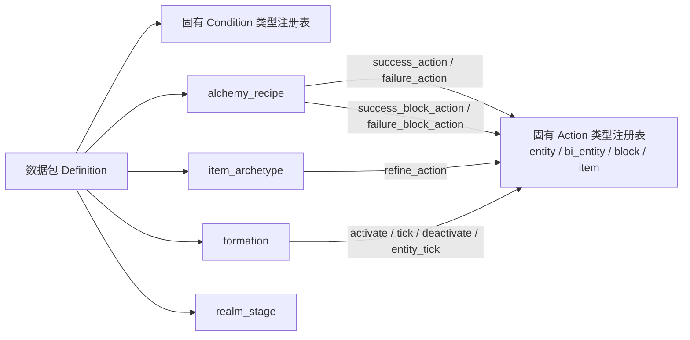

# 注册表结构与引用关系图

```mermaid
flowchart LR
  ACTION[固有 Action 类型注册表\nentity / bi_entity / block / item]
  CONDITION[固有 Condition 类型注册表]
  DATA[数据包 Definition]
  ALC[alchemy_recipe]
  ART[item_archetype]
  FORM[formation]
  REALM[realm_stage]
  DATA --> ALC
  DATA --> ART
  DATA --> FORM
  DATA --> REALM
  ALC -->|success_action / failure_action| ACTION
  ALC -->|success_block_action / failure_block_action| ACTION
  ART -->|refine_action| ACTION
  FORM -->|activate / tick / deactivate / entity_tick| ACTION
  DATA --> CONDITION
```

所有生命周期扩展均通过 Action 字段内联，数组按顺序执行；不再存在领域 behavior 注册表。
