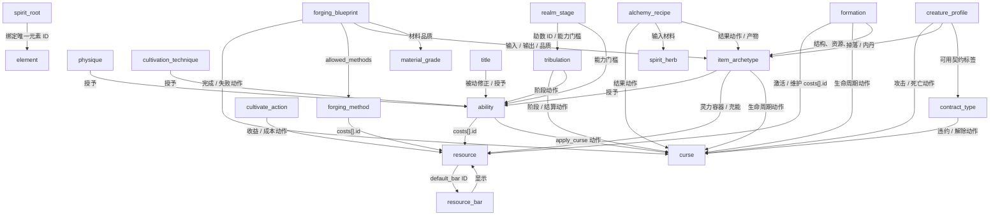
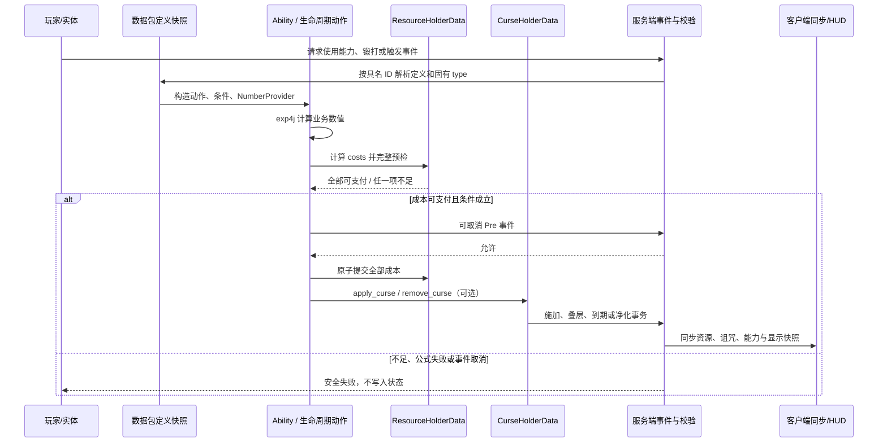
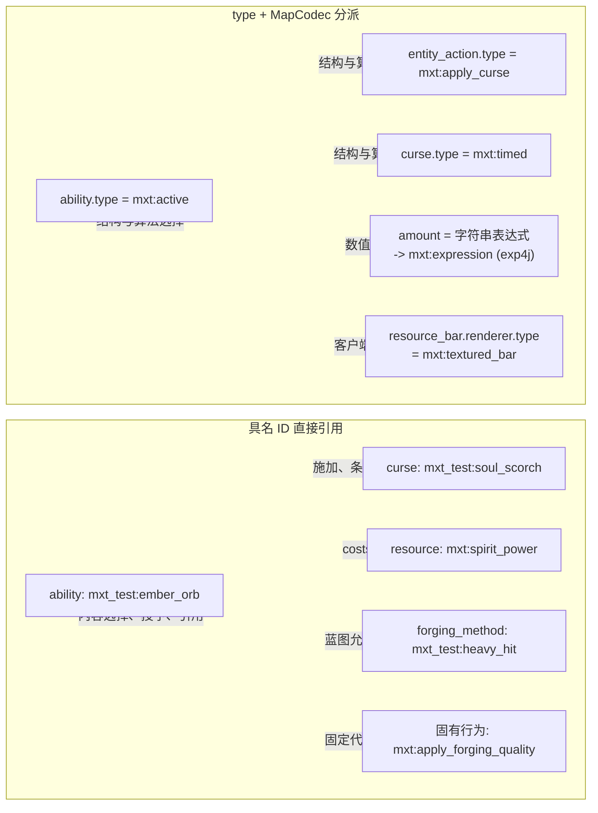

# 注册表结构与引用关系图

本文汇总固有注册表、数据包注册表、原版扩展注册表与运行时状态的内容结构。箭头约定：

- `type`：数据包对象通过 `type` 字段由固有 `MapCodec` 分派。
- `ID`：一个具名数据包定义或固有行为被另一对象按完整资源 ID 引用。
- `状态`：静态定义在运行时创建、读取或解释 Attachment/Data Component 状态。

## 总体分层

```mermaid
flowchart LR
    subgraph JAVA["Java 加载期：固有注册表"]
        direction TB
        ABT["mxt:ability_type"]
        ABC["mxt:ability_component_type"]
        ABTR["mxt:ability_trigger_type"]
        ACT["动作类型\nentity / bi_entity / block / item"]
        CON["条件类型\nentity / bi_entity / block / item / damage"]
        NUM["mxt:number_provider_type\n含 expression (exp4j)"]
        MOD["mxt:value_modifier_type"]
        CURT["mxt:curse_type"]
        RESV["mxt:resource_value_provider_type"]
        BARR["mxt:resource_bar_renderer_type"]
        BARV["mxt:resource_bar_visibility_type"]
        FCB["mxt:forging_completion_behavior"]
        FLB["mxt:formation_lifecycle_behavior"]
        TSB["mxt:tribulation_stage_behavior"]
        CLB["mxt:contract_lifecycle_behavior"]
        COB["mxt:cultivation_outcome_behavior"]
    end

    subgraph DATA["数据包重载期：具名动态注册表"]
        direction TB
        REALM["realm_stage"]
        ELEM["element"]
        ROOT["spirit_root"]
        PHY["physique"]
        RESOURCE["resource"]
        BAR["resource_bar"]
        CURSE["curse"]
        ABILITY["ability"]
        TECH["cultivation_technique"]
        CULT["cultivate_action"]
        ITEM["item_archetype"]
        FM["forging_method"]
        FB["forging_blueprint"]
        HERB["spirit_herb"]
        ALC["alchemy_recipe"]
        FORM["formation"]
        TRIB["tribulation"]
        CREATURE["creature_profile"]
        CONTRACT["contract_type"]
        TITLE["title"]
        GRADE["material_grade"]
    end

    subgraph VANILLA["原版 / NeoForge 固有扩展"]
        direction TB
        LOOTF["Loot Function Type"]
        LOOTC["Loot Condition Type"]
        RECIPE["Recipe Serializer"]
        COMPONENT["Data Component Type"]
        ATTACH["Attachment Type"]
        PAYLOAD["Payload Type"]
        TRIGGER["Trigger Type"]
    end

    subgraph STATE["服务端运行时状态"]
        direction TB
        SPIRIT["SpiritData"]
        RH["ResourceHolderData"]
        CH["CurseHolderData"]
        CC["CurseContainerData"]
        AH["AbilityHolderData"]
        ART["ArtifactData"]
        FS["ForgingSessionData / ForgingResultData"]
        AURA["AuraChunkData / FormationInstance"]
        CT["ContractData"]
        TD["TribulationData"]
    end

    ABILITY -->|"type"| ABT
    ABILITY -->|"type"| ABC
    ABILITY -->|"type"| ABTR
    ABILITY -->|"type"| ACT
    ABILITY -->|"type"| CON
    ABILITY -->|"数值"| NUM
    ABILITY -->|"修饰"| MOD
    CURSE -->|"type"| CURT
    CURSE -->|"动作 / 条件 / 数值"| ACT
    CURSE -->|"动作 / 条件 / 数值"| CON
    CURSE -->|"数值"| NUM
    RESOURCE -->|"type"| RESV
    BAR -->|"renderer.type"| BARR
    BAR -->|"visibility.type"| BARV
    FM -->|"条件 / costs"| CON
    FM -->|"costs 数值"| NUM
    FB -->|"完成 / 失败行为 ID"| FCB
    FORM -->|"动作"| ACT
    FORM -->|"生命周期行为 ID"| FLB
    TRIB -->|"动作"| ACT
    TRIB -->|"阶段行为 ID"| TSB
    CONTRACT -->|"绑定 / 解除行为 ID"| CLB
    REALM -->|"突破结果行为 ID"| COB

    SPIRIT --- ATTACH
    RH --- ATTACH
    CH --- ATTACH
    AH --- ATTACH
    AURA --- ATTACH
    TD --- ATTACH
    CC --- COMPONENT
    ART --- COMPONENT
    FS --- COMPONENT
    LOOTF -->|"施加 / 移除"| CURSE
    LOOTC -->|"判定"| CURSE
    RECIPE --> ALC
    PAYLOAD --> RH
    PAYLOAD --> CH
    PAYLOAD --> AH
    TRIGGER --> REALM
```

## 数据包定义之间的引用

## 执行与状态引用

## 直接引用与 `type` 分派

数据包只能新增或覆盖具名定义，并选择已经存在的 `type` 与固有行为 ID；新的 Codec、渲染器、原版扩展类型和网络语义仍必须由 Java 在加载期注册。
