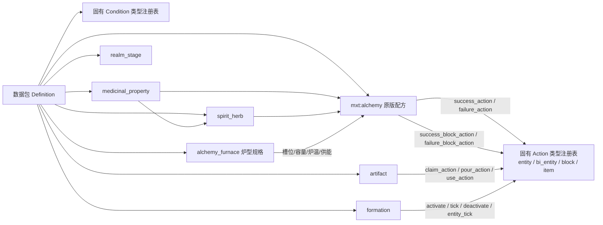

# 注册表结构与引用关系图

```mermaid
flowchart LR
  ACTION[固有 Action 类型注册表\nentity / bi_entity / block / item]
  CONDITION[固有 Condition 类型注册表]
  DATA[数据包 Definition]
  PROP[medicinal_property]
  HERB[spirit_herb]
  FURNACE[alchemy_furnace 炉型规格]
  ALC[mxt:alchemy 原版配方]
  ART[artifact]
  FORM[formation]
  REALM[realm_stage]
  DATA --> PROP
  DATA --> HERB
  DATA --> FURNACE
  DATA --> ALC
  DATA --> ART
  DATA --> FORM
  DATA --> REALM
  PROP --> HERB
  PROP --> ALC
  HERB --> ALC
  FURNACE -->|槽位/容量/炉温/供能| ALC
  ALC -->|success_action / failure_action| ACTION
  ALC -->|success_block_action / failure_block_action| ACTION
  ART -->|claim_action / pour_action / use_action| ACTION
  FORM -->|activate / tick / deactivate / entity_tick| ACTION
  DATA --> CONDITION
```

所有生命周期扩展均通过 Action 字段内联，数组按顺序执行；不再存在领域 behavior 注册表。

2026-09-27：`mxt:alchemy` 仍是原版配方类型，不是数据包注册表。药性与炉型规格是新增的两张数据包注册表（注册表总数 37）。丹炉的世界载体是手搭 3×3×3，控制器在正面中层本地 (1,1,0)，不另做任意结构 schema。炉型规格只提供槽位、容量、炉温与供能，不从品质序号推导这些数。
