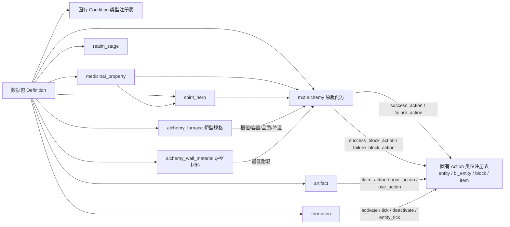

# 注册表结构与引用关系图

```mermaid
flowchart LR
  ACTION[固有 Action 类型注册表\nentity / bi_entity / block / item]
  CONDITION[固有 Condition 类型注册表]
  DATA[数据包 Definition]
  PROP[medicinal_property]
  HERB[spirit_herb]
  FURNACE[alchemy_furnace 炉型规格]
  WALL[alchemy_wall_material 炉壁材料]
  ALC[mxt:alchemy 原版配方]
  ART[artifact]
  FORM[formation]
  REALM[realm_stage]
  DATA --> PROP
  DATA --> HERB
  DATA --> FURNACE
  DATA --> WALL
  DATA --> ALC
  DATA --> ART
  DATA --> FORM
  DATA --> REALM
  PROP --> HERB
  PROP --> ALC
  HERB --> ALC
  FURNACE -->|槽位/容量/品质/降温| ALC
  WALL -->|最低耐温| ALC
  ALC -->|success_action / failure_action| ACTION
  ALC -->|success_block_action / failure_block_action| ACTION
  ART -->|claim_action / pour_action / use_action| ACTION
  FORM -->|activate / tick / deactivate / entity_tick| ACTION
  DATA --> CONDITION
```

所有生命周期扩展均通过 Action 字段内联，数组按顺序执行；不再存在领域 behavior 注册表。

2026-09-27（合并主分支）：`mxt:alchemy` 仍是原版配方类型，不是数据包注册表。药性、炉型规格与炉壁材料是新增的三张数据包注册表；主分支移除 `quality_chain` 后合计 37 张，拆出 `mxt:pill` 之后为 38 张（见 [`59`](59_丹药定义与绑定拆分设计.md)）。丹炉是手搭 3×3×3，核心在正面中层本地 (1,1,0)，三个物品仓独立持有库存，22 块炉壁共同限制最高炉温。炉型只提供槽位、容量、品质与降温；供热走异火的 `AlchemyHeatSource` 接口，不从品质序号推导能力，也不使用灵气银行。

2026-10-04：结构改版（底层只校验四角、上面两层填满、炉壁 18 格，见 [`58`](58_丹炉部件分工与异火供热设计.md) 追记）；同日**新增第 39 张数据包注册表 `mxt:heat_source`**，供热改成**底层正中央那一格里的方块**，`AlchemyHeatSource` 降为该方块的可选接口（见 [`68`](68_方块供热与热源注册表设计.md)）。上面那句"22 块炉壁"与"供热走异火接口"由此作废。
