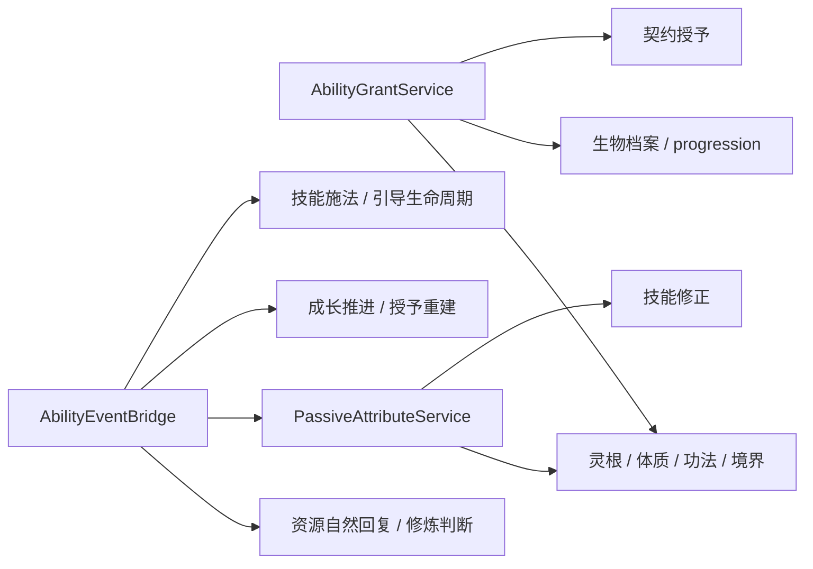

# MiXianTu 全模块架构与功能审计

审计日期：2026-10-04。代码基线：`78115723270447b7532cdf5b90803d8a9e55039f`，以本次读取的工作树为准。本文是审计结果，不代表这些问题已经修复，也不替代 README 的模块完成情况表。

## 1. 结论与范围

针对本次要求，结论如下：

1. **未发现另起一套完整的技能、伤害、修炼或生产模块，但确实存在重复的规则实现。** 最明显的是链遍历与校验、修炼 tick 的两条算法路径，以及临时 `minecraft:consumable` 的两套写入和回收协议。重复的问题已经表现为语义差异，而不只是文件多。
2. **存在核心服务反向枚举其他业务模块的情况。** `AbilityGrantService` 硬编码修炼身份、生物成长、契约的来源；`PassiveAttributeService` 硬编码境界、功法、体质；`AbilityEventBridge` 还承担资源初始化、自然回复、属性刷新、Curios 同步和成长推进。增加一个来源，常常必须修改这些中心类。
3. **存在可由代码直接推导的功能缺陷。** 高优先级包括品质命名继承遇环无限遍历、装备撤销使用错误来源、技能授予重建清空仍有效的运行状态、阵法维护错误地先验全额付款、符箓效果执行后才扣载体费用，以及交易确认后报价仍可变化。多个功能失败都与“先预演、再分段提交”或“来源身份与生命周期不一致”有关。

审计方法是文件清点、依赖搜索、调用点追踪和关键状态变化路径阅读；不是对每一行代码逐行证明，也不是游戏验收。本次清点到 `src/main/java` 中 1143 个 Java 文件、约 87316 行，其中 `runtime` 205 个文件、27 个模块目录；`data` 468 个文件、`api` 19 个文件、`attachment` 23 个文件。测试模组有 17 个 Java 文件，已有命令式探针，但没有 JUnit 测试源。

重点追踪加载与缓存、授予与撤销、使用与付款、tick 调度、存档与同步、容器会话及可选依赖边界。README 的 24 项模块与全部 27 个 runtime 目录均纳入入口和主干审查；较薄的适配模块只做边界检查，具体覆盖见第 6 节。

开始时已有以下改动，本文没有覆盖或整理它们：

- `research/README.md` 已修改。
- `research/audit/依赖关系图.md` 未跟踪。
- `research/audit/依赖关系总图.md` 未跟踪。

下文源码定位均以 `src/main/java/com/iafenvoy/mxt/` 为基准，路径后的数字是本次审计时的行号。**“静态确认”表示条件成立时，当前代码会走出所述结果；不表示已经在游戏中复现。**

| 级别 | 含义 |
| --- | --- |
| P1 | 应优先修复：可能卡死加载、保留非法状态、错误扣费或破坏交易双方同意 |
| P2 | 有明确边界或生命周期缺口，或需要特定配置、扩展调用才能触发 |
| P3 | 维护性问题、低优先级清理机会，尚无独立功能失败证据 |

## 2. 问题索引

同一问题的架构根因与功能表现交叉引用，不据此重复计算严重程度。

| 编号 | 级别 | 发现 | 证据性质 |
| --- | --- | --- | --- |
| A01 | P2 | 技能授予核心硬编码所有业务来源 | 静态确认 |
| A02 | P2 | 被动属性核心反向枚举境界、功法、体质 | 静态确认 |
| A03 | P2 | 技能事件桥成为全实体总调度入口 | 静态确认 |
| A04 | P2 | 数值服务认识境界，并自行遍历境界链 | 静态确认 |
| A05 | P3 | 数据、运行时、菜单及网络协议出现混层 | 静态确认；并非都构成功能缺陷 |
| A06 | P2 | 部分服务端写入口没有客户端拒绝边界 | 静态确认；常规网络入口仍在服务端 |
| D01 | P2 | 多套链遍历及拒收规则，坏链仍可回退执行 | 静态确认；含条件性的加载异常风险 |
| D02 | P2 | 修炼 tick 两条实现读取不同规则 | 静态确认；旧路径未找到仓库内外部调用点 |
| D03 | P2 | 临时 consumable 的写入、所有权和回收双轨 | 静态确认；遗留组件需特定物品移动情境 |
| D04 | P3 | 多处材料草稿、清槽和插入逻辑可复用 | 清理机会；不等于整个模块重复 |
| F01 | P1 | 品质名称继承在命名循环链上无限遍历 | 静态确认 |
| F02 | P1 | 装备变化撤销旧技能时使用新物品的来源 | 静态确认 |
| F03 | P1 | 授予重建清空仍然有效技能的存储状态 | 静态确认 |
| F04 | P2 | 差分撤销不清最后来源失去后的技能状态 | 静态确认 |
| F05 | P1 | 阵法先验主人全额余额，再减供给和库存 | 静态确认 |
| F06 | P1 | 阵法吸收按区块总量结算，丢失归属和距离 | 静态确认 |
| F07 | P2 | 同定义阵法实例共用技能来源、相互撤销 | 静态确认；需使用约定的阵法授予 source |
| F08 | P1 | 符箓先执行技能，载体付款失败后不耗符 | 静态确认 |
| F09 | P2 | 按键技能先付费，再检查能否起飞或开储物 | 静态确认；失败收费是否有意需确认 |
| F10 | P1 | 玩家交易确认不绑定报价，确认后仍能改物品 | 静态确认 |
| F11 | P2 | 交易会话关闭依赖客户端自定义 CLOSE | 静态确认；原版关闭或服务端换菜单可触发 |
| F12 | P2 | 修炼环境灵气与其他费用分段提交，后失败不整体回退 | 静态确认；需第二段提交失败 |
| F13 | P2 | 复合技能逐子技能提交，后失败不撤销先前付款与状态 | 静态确认；需预演后提交仍失败 |
| F14 | P2 | 秘境先写旅行状态，忽略传送和回收失败 | 静态确认；具体平台失败情境待实机 |

此外有两项需要确认设计或平台行为的观察，单列于第 5 节，不混入已确认缺陷。

## 3. 模块边界与重复实现

### A01：AbilityGrantService 硬编码授予来源

证据：`runtime/ability/AbilityGrantService.java:43` 的 `recalculate` 直接串起 `cultivation`、`creature`、`contract`；`:57` 读取灵根、体质、功法和境界记录，`:86` 读取生物档案及成长层级，`:100` 调用 `ContractGrantService.heldTypes`。

这不是单纯“调用其他 Service 太多”，而是技能内核掌握每个业务来源的附件形状、累积规则与来源命名。新模块要授予技能，必须进核心补一条分支；来源收集、状态更新和触发器重建又绑在同一个方法中。F03 是它当前的直接功能后果。

建议由业务模块注册授予来源提供者，返回期望的 `source → ability ids`，由技能模块统一差分更新账本。**账本和状态清理仍保留一个出口**，不要反过来让每个业务模块各写一套授予算法。现有 `HoldLookup.register`、`TriggerRehydrators.register`、`QualityService.carry` 已有可参考的注册形状。

### A02：PassiveAttributeService 是全业务属性聚合器

证据：`runtime/ability/PassiveAttributeService.java:93` 的 `entries` 不仅读取技能修正，还直接读取 `CultivationAttachment`、`SpiritIdentityAttachment`，枚举境界、功法与体质的属性表。

名字和包位置表明它属于技能，实际职责是所有数据包被动属性的收集与应用。新的属性来源必须修改该类。每个 living entity 的 tick 又通过 `getData` 创建修炼与身份附件，即使该实体没有相关身份；这违反只读查询优先 `getExistingData` 的仓库口径。

建议保留统一的属性应用、差分清理与 modifier id 规则，将来源收集改成注册式提供者；缺少附件的来源应答空，而不是创建空附件。清理属性的 `WRITTEN_ATTRIBUTES` 机制有实际用途，不应在拆分时丢掉。

### A03：AbilityEventBridge 承担了全实体总调度

证据：`runtime/ability/AbilityEventBridge.java:91` 的 `onEntityTick` 同时执行：

- 创建技能和资源附件、初始化 HUD 资源。
- 枚举所有 Aura 并处理自然回复，调用修炼服务决定是否跳过。
- 发布 tick 触发器、刷新被动属性。
- 每 20 tick 同步 Curios 技能、推进 progression 并重算技能授予。
- 推进技能 tick、完成施法、维持引导。

其中最后一组才是技能自身生命周期。当前中心类既做调度又掌握业务规则，容易出现顺序隐含依赖，例如第 5 节的自然回复观察。没有性能基准，本文不把“每 tick 遍历”直接判成已发生的性能故障。

建议将资源回复、成长推进等职责交还所属模块的事件桥；若顺序必须严格固定，应放到中立调度器并声明阶段，不能只靠移动 `@SubscribeEvent` 方法碰运气。技能桥保留技能生命周期和技能相关信号适配。

### A04：ResourceService 反向依赖修炼领域

证据：`runtime/resource/ResourceService.java:82` 的 `formulaContext` 主动读取并创建修炼附件；`:104` 的 `realmRank` 认识 Aura、RealmStage、ServerCache，还在缓存查不到时从 `firstRealm` 自行走 `nextRealm`，上限 1024。

仓库定义 `resource` 为通用数值系统；“这个值对应哪个境界、排名多少”应属于修炼上下文。当前通用服务因此依赖修炼身份和世界加载缓存，同时出现 D01 的重复走链。

建议数值服务只处理值、上下限和事务；境界变量由修炼侧或统一公式上下文提供者注入。不要删除公式能力，只需把业务来源的知识移出数值核心。

### A05：存在混层，但需按具体职责判断

| 位置 | 当前耦合 | 建议 |
| --- | --- | --- |
| `registry/MxtDataMaps.java:14` | `BLOCK_AURA` 的 merger 类型在 `BlockAuraService` 内 | 将纯合并规则放到数据或中立 helper，注册与运行时共用 |
| `data/CreativeTabHelper.java:3` | 数据侧 helper 依赖 `screen.picker` 的目录管理类型 | 将公共物品目录和 UI 呈现分开；这不是已经证实的客户端类加载崩溃 |
| `data/forging/ForgingBlueprint.java:7` | Definition 引用运行时 `ForgingPlan` 常量 | 将定义与结算都用到的限制常量移到中立位置 |
| `runtime/economy/PlayerTradeService.java:88`、`:171` | 会话状态同时认识网络动作枚举、创建菜单、管理报价与成交 | 动作语义归领域，菜单和网络作为适配层；服务端打开 common menu 本身合理 |

不能把 `data/action/builtin` 调运行时服务也统统归为混层错误：它们本来就是行为的执行实现。也不能仅因类位于 `screen/menu` 就认定服务端不允许引用，它通常是两端共享的容器模型。

### A06：服务端写入口的边界不统一

证据：`runtime/ability/AbilityService.java:112`、`:164`、`:220` 的使用、施法完成和 gate；`AbilityActivationService.java:27` 的激活；`AbilityGrantService.java:43` 的授予重建，均未在入口拒绝客户端。`AbilityService.Failure` 声明了 `SERVER_ONLY`，但这些路径没有使用它。`runtime/item/PillService.java:98` 的 `apply` 也直接运行行为并改丹毒，而同类 `registerUse` 和 `modify` 有客户端保护。`runtime/perch/PerchService.java:25`、`:51` 的挂靠和释放同样缺少对应边界。

常规事件与网络调用多数在服务端，**本项不代表已经发现网络越权入口**；问题是 public 服务被附属模组直接调用时，可以改客户端镜像、执行行为或先扣客户端资源再失败，与仓库统一结果记录口径不一致。

建议在权威写入入口拒绝客户端并返回对应结果，明确那些允许两端运行的纯查询、视觉预测和原版使用适配。D03 的 use-cycle 适配不能机械地套成只在服务端运行。

### D01：链遍历与校验仍有多套实现

目前至少有以下路径：

| 链规则 | 实现 |
| --- | --- |
| 品质、境界的公共索引 | `util/ChainCache.java` |
| progression 的 head、rank、坏链检查 | `runtime/ServerCache.java:353` 的 `rebuildProgressionChains` |
| progression 的成员判定 | `runtime/progression/ProgressionService.java:150` 的 `follows`，自行遍历，限制 512 |
| 境界排名回退 | `runtime/resource/ResourceService.java:104`，自行遍历，限制 1024 |
| 境界下一档回退 | `runtime/cultivation/CultivationService.java:163`，索引答空时读取定义自己的 `nextRealm` |

已经出现三种不一致：

1. `ChainCache.Builder.build`（`:243`）收集 `forks` 日志后继续建索引。`A → C`、`B → C` 两个入口时，第一条路径可完整入索引，第二条因并入已索引链而被拒绝；分叉只被报告，没有导致所有受影响支链拒收。`forks`（`:291`）也只是返回 reports。它与 AGENTS 的“坏链接整条不索引”不一致，实际结果受入口遍历顺序影响。
2. `ServerCache.rebuildProgressionChains` 也在记录分叉后继续索引第一条路径；缺失 `next_level` 在 `:361` 被记录后没有进入拒收集合，后续 `:388` 对 `stages.get(current).mastery()` 解引用。**只有缺失 holder 能进入这一阶段时才会 NPE**；普通 JSON 引用可能先被注册表加载校验挡住，不能写成任意坏 id 都必然在这里崩溃。
3. 境界链被缓存拒收，`CultivationService.next`（`:171`）仍回退到定义链接继续突破；`ResourceService.realmRank` 同样可能继续从原始定义计算排名。“无服务器索引”和“服务器已经判定坏链”被视为相同的 empty。

建议把通用直线图遍历、成环、分叉、相交及整链拒收统一到 `ChainCache`，progression 只提供领域额外检查；先修公共 builder 的分叉拒收。调用者需区分缓存不可用、条目不存在和链不合法，不能把非法结果回退成成功。

### D02：CultivationMethodService 的 tick 算法双轨

证据：`runtime/cultivation/CultivationMethodService.java:84`、`:91` 暴露 `AuraChunkAttachment` 路径，最后进入 `:184` 的旧算法；`:98`、`:106` 的 `AuraResult` 路径进入 `:115` 的当前算法。

| 行为 | 当前 `entity + AuraResult` | `AuraChunkAttachment` 路径 |
| --- | --- | --- |
| 法门 `cultivate_condition` | 每 tick 检查，false 保持会话但暂停成果 | 不读取 |
| `tick_action` / `cultivate_action` | 执行 | 不执行 |
| 环境与当前身体检查 | 读取环境规则与实体 | 不具备同等检查 |
| `absorb_amount` | 作为回复倍率，与 Aura 的 regen 等组合 | 作为直接增量 |
| 物品灵气恢复 | 调 `ItemAuraService.tick` | 不执行 |

调用点搜索显示，仓库内生产路径和测试探针使用当前算法，未找到其他文件调用旧路径。这降低了“当前主游戏流程双重结算”的风险，但 public 重载仍是不同规则的可调用入口，也增加修改漏同步的概率。

建议先明确外部契约，再删除或弃用旧路径；若需要无实体算法测试，抽当前算法的纯计划阶段，而不是保留第二套玩法结算。不能仅凭仓库内无调用就认定 public 方法可无条件删除。

### D03：临时 consumable 的所有权和回收双轨

证据：`runtime/hold/HoldService.java:29` 声称是本模组唯一 consumable 写入处，`:124` 实际写入；`runtime/item/PillUseService.java:62` 也写入。前者开始使用后就移除组件、防止原版吞物品；后者保留组件让原版完成进食，然后回收。

两种业务语义不同，**不能直接合并为同一种“长按”**。`PillUseService` 已明确让 hold 优先，所以未发现普通右键必然双重接管的问题。重复在临时组件的租用、所有权识别及生命周期管理。

另一个具体风险是 `PillUseService.ARMED`（`:31`）只记录实体 UUID，`takeBack`（`:85`）只剥当前主副手的组件。若取消前原 stack 被服务端逻辑移到别的槽，回收找不到它；若手里换成另一份恰好等于该 consumable 的自定义 stack，组件相等也不足以证明它属于本次使用。跨两端共享静态记录的情形也需要在客户端验证。

建议共享“临时使用组件”的所有权和清理机制，各模块保留是否消耗、何时撤组件的策略，并纠正“唯一写入”的失实注释。追踪对象不能只有 UUID 和组件相等判断。

### D04：库存材料算法有复用机会，不应粗暴合并业务事务

锻造的 `StartupMaterials`、炼丹工作站的材料草稿与插入、`data/cost/ItemCostDraft.java`、经济系统的货币和工作站库存处理，都有扫描、预留、清槽、复制、插入等局部形状。

这些操作的付款者、槽位限制、退料方式、质量判定和失败语义不同。本次没有据此认定它们是“重复的整个模块”。可优先复用中立的槽位草稿、插入和回滚工具，业务计划仍各自保留。货币的面值与找零不是 `Cost`，不得为了去重强行并入使用消耗系统。

## 4. 功能与状态一致性

### F01（P1）：品质名称继承在环检测之前无限循环

证据：`data/quality/QualityLadders.java:53` 在构建 `ChainCache` 之前调用 `inherit`；`:96` 的继承遍历只有缺失节点和无后继两个退出条件，`:102` 没有 visited 检查，`putIfAbsent` 的结果也没有用于退出。

触发条件：`A` 声明 `quality: Q` 且 `next: B`，`B` 的 `next: A`；或者一个声明 quality 的节点能走进循环。两个 holder 都有效时，继承会反复走 `A/B`，永远到不了公共链缓存的环检测。没有任何 quality 名称的环不触发这一处无限循环，仍应由后续链校验处理。

影响：数据包加载或品质索引首次构建可能卡死，而不是输出预期的坏链诊断。建议名称继承同样使用有 visited 的公共遍历，或先校验拓扑再继承名称。

复测：命名自环、命名双节点环、命名入口接入环、无名称环；均应有限时间返回诊断且不建有效索引。

### F02（P1）：装备变化用新物品来源撤销旧技能

证据：`runtime/ability/AbilityEventBridge.java:182` 从 `event.getTo()` 构造 source，`:183` 用这个 source 撤销 `event.getFrom()` 的技能。`AbilitySources.java:28` 的来源包含装备槽和物品 registry id，空堆为 `minecraft:air`。

例如装备 A 时来源为 `equipment/mainhand/.../A`；换成 B 或卸下时，却请求撤销 `equipment/mainhand/.../B` 或 air。旧来源仍在账本，A 的技能继续持有，相关触发器重建又将残留技能视为有效。

建议分别计算 fromSource 与 toSource，撤销和授予使用各自来源；若改成槽位来源，则整套生命周期必须差分重建该槽的期望集合。

复测：A→空、A→B、A→同物品不同组件定义、双槽给同技能、Curios 与手持同时授予；最后一个有效来源失去后才应移除技能。

### F03（P1）：重算授予先清空，再重新授予，导致状态丢失

证据：`AbilityGrantService.java:47` 撤销所有 `grant/` 来源后再枚举授予；`attachment/AbilityAttachment.java:77` 的 `revoke` 在最后一个来源消失时调用 `storage.clear(ability)`。

只靠定义授予的技能，即使重建前后都存在，也会在中间瞬间失去全部来源并清空 storage。学习/遗忘其他功法、子境界变化、生物成长、契约变化和登录重建，都可能清除该技能的冷却、次数及其他存储状态；若另有未撤销的装备或脚本来源，则不会在这一轮失去最后来源。

建议先收集完整 desired ledger，再做最终差分；只有最终真正消失的技能才能清理存储。不要通过保留无效来源或禁止所有重算来掩盖问题。

复测：让技能进入冷却或扣掉一次 charge，再学不相关功法、突破、变更契约和重登；仍被授予的技能状态应保留，真正失去全部来源的技能状态应删除。

### F04（P2）：reconcileSource 与 revoke 的清理语义不一致

证据：`AbilityAttachment.java:86` 的 `reconcileSource` 只更新 `SourceLedger` 并标脏，没有像 `revoke` 一样清理最后来源消失后的 storage。`runtime/formation/FormationEntityActions.java:59` 正通过它批量释放阵法技能。

结果是逐项撤销会删除技能状态，而差分撤销会保留。技能再次获得时可以继承旧冷却或其他旧 storage；这是 F03 的相反方向，说明生命周期约束没有落在共同账本更新出口。

建议所有来源更新走统一 reconcile，并按“更新前持有、更新后不持有”清理一次。复测应比较逐项撤销和差分撤销的最终账本与 storage。

### F05（P1）：阵法维护先验全额余额，违背供给与库存先付款

证据：`FormationService.MaintainRule.plan`（`runtime/formation/FormationService.java:107`）先对完整 maintenance costs 调 `CostTransaction.plan`；`data/cost/CostTransaction.java:216` 在计划期对主人资源检查全额可用性。随后 `FormationService.java:123` 才减去 supply、stock 并得出 `fromOwner`。

例：本期费用 4，方块供给 1.5，主人余额 2.5。实际只需主人付 2.5，但计划期先检查 4，直接拒绝。主人离线时 `FormationWorldTicker.java:90` 使用空账户，库存足够支付的非零费用也可能在减库存前被拒绝，与代码注释承诺的离线库存维护不符。

建议先求费用数额和通道合法性，再决定三方承担的量，最后只检查/提交主人差额；不能用普通付款计划的“全額可用性检查”代替费用求值。保留维护失败不写库存的约束。

复测：供给全额覆盖、库存全额覆盖、离线库存覆盖、主人仅够差额、主人差额不足、异种 Aura 供给。现有测试命令中有 upkeep bill 探针，但本次没有运行；探针的空账户是否触发拒付还取决于 resource 的默认值。

### F06（P1）：区块吸收总量不能回答“这一个阵法吸收多少”

证据：`runtime/world/BlockAuraService.java:51` 为每个 emitter 记录的只是“位于任意阵法内”的 boolean；`FormationAbsorption.java:59` 查询当前阵法时，遍历其 x/z 包围框涉及的区块，把 `AuraChunkAttachment.absorbedAura()` 全部相加。

该聚合没有保留 controller/实例归属，也没有在结算时重新检查 emitter 到当前阵法的三维距离。因此同区块不同阵法、上下不同高度的阵法，或者包围框角落属于另一阵法的 emitter，都能被算进当前阵法的 supply。多个阵法可以重复使用同一份吸收总量。

建议为 emitter 保留位置和有效归属，按实例构建供给索引；若允许重叠，应明确分配或共享规则。只把区块总量减一次，并不能保证实例账单不重复领取。

复测：同区块两个不相交阵法、上下堆叠、重叠、跨区块边界、移除一个阵法后的供给重建。环境浓度是否为无限维护来源是另一个设计问题，本文不把它直接判为同一缺陷。

### F07（P2）：同定义阵法实例互相撤销技能

证据：`runtime/formation/FormationSources.java:15` 的 source 只含 formation 定义 id；`FormationWorldTicker.java:136` 使用它，`:170` 的 `releaseOutside` 又逐实例判断范围，站在某实例外就释放该定义的 source。

若 A、B 是同一定义的两处阵法，玩家处于 A 内、B 外，A 对约定 source 的授予可以被 B 的清理撤掉；B 停用或玩家离开 B 也无法区分 A 的授予。触发前提是数据包按约定将授予技能的 source 写成这份阵法来源；任意脚本自定义的来源不一定受这套清理管理。

建议授予的生命周期身份含维度和 controller/实例 id，或者由阵法模块维护实例计数再统一输出定义级授予。相应解决跨维度、离线和重建后的来源清理，不能只改一个字符串生成器。

复测：同定义两个不相交实例、重叠实例、停用其一、传送离开维度和重登。

### F08（P1）：符箓效果执行后才付款，付款失败仍保留载体

证据：`runtime/talisman/TalismanService.java:291` 只预演载体费用；`:300` 调 `AbilityService.useCarried` 实际执行技能及其费用/效果；`:314` 才提交载体费用，失败直接返回；`:323` 才扣载体灵气，`:326` 才消耗载体或耐久。

无需并发即可构造：持有人资源 10，符箓向持有人收 10，技能自身收 1。载体预演通过，技能扣 1 并产生效果后剩 9，载体费用提交失败，符箓未扣存量和耐久。技能动作改变付款资源或物品也能形成同类情境。

建议在效果发生前统一预演、预留载体和技能的总费用，再提交与执行；需保留“所有技能都拒绝则不收费”的现行语义。不能只把最后扣费提前到最前面，否则又引入全部技能失败仍收费的问题。

复测：载体与技能共享资源、共享物品、全部技能拒绝、部分技能成功、技能动作改变付款资源、带耐久与一次性载体。

### F09（P2）：按键技能先扣费，实际激活检查在后

证据：`runtime/ability/AbilityActivationService.java:32` 先执行 `AbilityService.gate`；后者在 `AbilityService.java:238` 已付款并写冷却（`:241`），然后才调用 type 的 `activate`。

`FlightControlAbilityType.java:81` 此后调用 `FlightService.mount`，该服务在 `:91` 才发现无载具、`:95` 才判断所有权、`:99` 才检查速度。`StorageAbilityType.java:49` 此后才判断 ServerPlayer、carrier、容量及所有权。技能已授予、条件通过且写了 costs/cooldown，但手上没有合法载体时，会收到失败结果却仍被收费并进入冷却。

当前行为可直接确认，但“失败的激活是否应收费”尚需明确策划口径。若失败应无副作用，建议 type 先产生激活计划，公共 gate 付款后应用计划。起飞可能改变物品保管关系，不能仅对已经执行的 activate 做事后撤销。

复测：无飞行法器、非本人法器、无储物载体、容量公式无效、落地免费、实际起飞成功。

### F10（P1）：交易确认不绑定报价版本

证据：`runtime/economy/PlayerTradeService.java:181` 只保存 `accepted`，双方 true 就在 `:193` 成交；`:288` 的 offer 是没有修改 listener 的普通 `SimpleContainer`。`screen/menu/PlayerTradeMenu.java:109` 为自己的报价创建普通可操作 Slot，`:73` 的 shift-click 也没有确认状态限制。

A 确认后，B 可以取走或替换自己报价中的物品再确认，最终交换的是修改后的报价，A 的同意没有被作废。物品变化与 accepted 状态完全脱离。

建议任一报价变化都清双方 accepted 并同步；或者确认后锁定报价，同时对成交所用快照/版本进行检查。UI 的本地按钮状态不能代替服务端报价版本。

复测：确认后普通点击、shift-click、拖拽、物品数量变化、双方同时确认；报价改变后必须重新确认。

### F11（P2）：关闭交易依赖客户端发送自定义动作

证据：`PlayerTradeMenu` 没有服务端 `removed` 回调，`:92` 的 `stillValid` 永远 true；GUI 的 `onClose` 发自定义 CLOSE。`PlayerTradeService.java:92` 只检查发送动作的一方仍持有当前菜单；`:273` 的存活检查仅判断双方在线，成交也不核双方菜单。

若只处理原版关闭容器包、服务端替换菜单，或客户端没发送额外 CLOSE，旧会话仍在。报价可能留在不可达的容器里，使玩家继续 BUSY；已确认的一方菜单关闭后，另一方还可用旧确认完成交易。代码注释还明确保留菜单消失后的 accepted，说明不是简单漏一次网络检查。

建议菜单服务端关闭直接通知领域会话取消/归还报价，且避免成交引起关闭时重入取消；成交前重新检查双方有效会话。自定义 CLOSE 可作 UI 意图，不应成为唯一清理来源。

复测：原版关闭、服务端强制换菜单、断线、已确认一方关闭、成交引发双菜单关闭、未发自定义 CLOSE 的客户端。

### F12（P2）：修炼两段付款没有整体回滚

证据：`CultivationMethodService.java:174` 先提交环境 Aura 计划；`:176` 再提交身体资源/物品/脚本费用。后者失败时直接返回，前一交易已扣的环境灵气没有回退。

通常数值和物品条件稳定时预演能挡住失败，但 `mxt:js` 的 consume 在提交时拒绝，就能让第二段失败。单份 `CostTransaction` 的回滚只覆盖自己写入的部分，不能回滚调用者之前完成的交易。

建议把一拍成果的受控付款通道放入共同计划，或提供外层可回退的协调事务。脚本自身外部副作用不具备通用回滚能力，这一公开限制不能被描述成“任何事情都可原子回退”；这里需要保证的是模组自己的环境池与数值写入不半途遗留。

复测：环境费用成功、后续脚本付款拒绝时，无成果且受控费用均不变；普通成功路径仍按 allocationFactor 扣取。

### F13（P2）：复合技能逐个提交不是整组原子

证据：`AbilityService.java:410` 依序对每个 child 执行 `commit`，后续提交失败在 `:414` 返回，前面的资源、冷却、次数状态没有整组 rollback；效果在 `:417` 之后才统一执行。

普通数值/物品草稿已做预演，不能声称日常余额不足必然触发。风险在预演通过后仍会失败的通道，例如第二个 child 的脚本 consume 拒绝：第一个 child 已付款、写状态，整组却返回失败且没有执行效果。

建议将所有 child 的受控费用与状态写入归入同一提交边界，并明确脚本副作用的非回滚限制。不要与 `CostTransaction` 已公开的“脚本最后执行、外部副作用不能回滚”重复报成同一个 bug。

复测：第二 child 的提交拒绝、重复 child id、共享资源与物品、含次数和冷却的 child；失败时至少模组受控状态应一致。

### F14（P2）：秘境状态写入与传送结果脱离

证据：`runtime/world/SecretRealmService.java:94` 先记成员、`:102` 写旅行附件，`:103` 忽略 `teleportTo` 返回后仍发布进入事件并执行进入行为。离开在 `:129` 忽略传送结果后清附件与成员；孤儿返回在 `:201` 同样如此。到期 `:164` 忽略 `leave` 失败继续 retire；强制销毁 `:185` 先移除记录，`:187` 忽略维度 delete 是否成功。

传送失败时，实体实际位置与旅行附件/成员表可能不一致。来源维度不存在时 leave 明确返回 false，到期或销毁却仍继续生命周期清理。`RuntimeDimensionService.java:86` 会阻止删除仍有玩家的维度，**因此不能把这条路径写成必然删除玩家所在世界**；可能出现的是秘境记录已移除而运行维度仍在，且调用者报告成功。

建议成功传送后再提交成员与旅行状态；失败返回结果并保留恢复信息。销毁要区分驱逐失败、记录退休和实际维度清理，不能丢弃下层拒绝结果。

复测：传送被平台或事件拒绝、来源维度缺失、非玩家 traveller、仍有玩家的维度销毁、失败后重新登录。实际失败钩子和跨维度实体行为本次未实机验证。

## 5. 待确认项与依赖图校准

### R01：修炼暂停成果时，自然回复是否也应该停止

`AbilityEventBridge.java:101` 在 `handlesNaturalRegeneration` 为 true 时跳过正常回复；`CultivationMethodService.java:291` 的该判断读取正在修炼和境界条件，不读取所选法门的 `cultivateCondition`。当前 tick 又在 `:127` 因法门条件 false 直接返回，连 `recover` 都不执行。

因此存在“仍在修炼但此拍不能产生成果”期间两条回复路径都不运行的情况。仓库明确“不扣费、不给收获、不推进结算”，但是否包括停止普通自然回复，缺少明确口径。应先确认设计，再决定补回复或明确文档；本文不直接认定它违反玩法。

### R02：秘境创建与到期读取不同维度时钟

`SecretRealmService.java:50` 使用 traveller 所在 level 的 `gameTime`，`plan`（`:211`）据传入时刻写 expiresAt；`SecretRealmBridge.java:33` 只从 Overworld 时钟检查到期。若运行维度的时钟因生命周期或平台 tick 规则与 Overworld 不一致，时限可能提前或延后。

本次没有证明各运行维度始终同钟，也没有运行空维度/动态维度时钟测试，所以这里只报告时钟来源不一致。建议统一生命周期时钟，或明确并验证多维度时钟一致的前提。

### 依赖关系不应只看 import 数量

静态类成员引用的近似依赖分析发现 `ability / creature / cultivation / damage / progression / trigger` 存在同一组强连通关系；另外直接读取确认 `formation ↔ world` 的双向关系。分析不涵盖所有实例调用、反射和运行时注册，因此不是完整调用图，也不能用强连通组替代逐条职责判断。

核心来源聚合的实际方向可概括为：



已有两篇依赖关系稿可以作为导航，但不能替代本次代码证据：“循环只有几对”的口径没有覆盖上述强连通组，“定义完全不 import runtime”的概括也有 `ForgingBlueprint` 等例外。本文没有修改这两份已有工作树文件。

改进方向是解除具体的反向业务枚举，而不是给所有 Service 包一层代理，或只把类搬到另一个包后宣布已解耦。

## 6. 模块覆盖与未误报的边界

“已审查”表示读过相关入口与关键路径，不表示该模块所有组合、数据包或平台行为通过测试。

| 模块 / runtime 目录 | 本次审查重点 | 结果与边界 |
| --- | --- | --- |
| 数据包基础、注册表、Codec、ServerCache | 加载、引用、链索引、缓存失效、命名文本 | F01、D01、A05；容错集合丢坏条目是既定规则，不能拿未知字段静默忽略当新缺陷 |
| `ability` | 授予、装备、触发重建、付款、复合、施法、按键 | A01–A03、A06、F02–F04、F09、F13 |
| `resource`、`aura` | 数值边界、事务、身份和数值的分工 | A04；ResourceTransactions 是受控数值层，CostTransaction 是多通道付款层，二者不是重复模块 |
| `cultivation` | 身份、功法、境界、法门选择、tick、回复、寿元入口 | D01、D02、F12、R01；灵根和体质职责不同，未建议合并 |
| `progression` | 成长入口、等级归属与累计授予 | D01、F03；与境界是不同领域，共用的是链算法 |
| `damage`、`element` | 结算出口、元素反应和重入边界 | 未发现第二套完整伤害结算服务；反应服务是伤害链上的领域协作，调用其他模块不自动构成错误 |
| `trigger`、`curse` | 分派、来源、重入、订阅重建与状态 tick | 注册式 rehydrator 有良好扩展边界；未发现需要新增第二套触发器总线的理由 |
| `formation`、`world` 的阵法/灵气部分 | 激活、维护、库存、供给、范围、授予清理 | F05–F07；FormationService 的结算与 WorldService 的世界生命周期分工合理 |
| `tribulation`、`lightning` | 时间线推进、行为执行、彩色闪电同步边界 | 薄入口及关键推进路径检查；未实测时序与渲染，不据此声称天劫验收通过 |
| `creature` | 档案、契约、行为输入、成长及技能来源 | A01、F03；契约行为注册与输入出口具有独立职责 |
| `world` 的秘境部分、`rift` | 旅行附件、成员、动态维度、到期、返回和删除 | F14、R02；动态维度 mixin 和跨维度运行行为未验证 |
| `spirit`、`energy` | 灌注、射线、存量适配与 hold 注册 | SpiritCharge 与 SpiritBurst 分别是灌注和传递/射线，非重复；ArtifactSpiritEnergy 是单 Aura 存量视图，未发现第二份独立存量 |
| `artifact` | 载体认领、御器、储物、周期维护 | F09；载具能力与控制技能的分层合理 |
| `forging` | 蓝图、计划、工作站、材料、品质写入 | D04、A05；计划结算与菜单适配不是重复锻造模块 |
| `alchemy` | 丹炉结构、供热、工作站、药性结算 | D04；生产丹药与使用丹药是不同生命周期；供热朝向、结构和实际温度未实机 |
| `item` 的丹药、灵植和绑定 | 用药、丹毒、临时使用、成长和载体绑定 | A06、D03；未对所有 vanilla item 的覆盖组合做动态验收 |
| `item` 的品质 | 三层解析、carrier 注册、阶梯、清除 | F01、D01；模块产出写品质与通用品质解析不同，不能合并掉生产判档 |
| `hold` | 右键接管、组件租用、模块注册 | D03；HoldLookup 的来源注册优于核心逐模块枚举 |
| `talisman` | 灌注、发动、费用、耐久、画符会话与产出 | F08；画符颜料是工具自己的存量，不应硬塞进付款者 Cost |
| `economy` | 货币、报价、确认、成交、关闭、归还 | F10、F11、A05、D04；货币价值/找零不等于使用费用 |
| `friend`、`perch` | 敌我判断、可选团队适配、挂靠写入 | A06；好友有向与 mutual/undirected 的差异是既定语义 |
| `wheel`、screen/HUD | 候选与已保存格分派、菜单会话、同步读取 | F09–F11；未做 AUI 页面交互、所有槽位、拖拽和视觉验收 |
| 网络、命令、KubeJS | 请求端类型、菜单校验、权威服务入口 | 主服务端 handler 与操作入口追踪；没有做恶意包、压力或全部权限组合测试 |
| 可选兼容、附件、mixin | 门内类型隔离、存档/同步、加载期注入 | FTB/GeckoLib 抽查符合门内隔离形状；未运行依赖缺失矩阵与 mixin 启动验证 |

正向边界值得保留：

- 技能定义统一为一个 `mxt:ability` 注册表，载体与其他定义按 holder/id 引用；未发现另起“法器内联技能”体系。
- 伤害结算有统一 `DamageCalculationService`；元素反应、身份修正是输入与领域协作，不能仅凭跨模块调用就拆出第二个出口。
- Cost 负责费用描述及多通道付款，ResourceTransactions 负责具体数值写入；问题在组合交易边界，而不是它们理应合成一个巨类。
- `QualityService.carry`、`HoldLookup.register`、`TriggerRehydrators.register` 提供了新增来源的扩展点，应将硬编码聚合改向这些既有模式。
- 炼丹与服药、锻造纯计划与工作站适配、阵法结算与世界实例管理，具有明确分工。本次没有依据将它们判为重复模块。
- `data` 中执行行为的实现调用 runtime 合理；公共菜单可由服务端打开；中立脚本回调不因路径位于 compat 就自动产生缺依赖类加载风险。

## 7. 验证记录

运行了仓库要求的基线命令：

```text
.\gradlew.bat compileJava compileTestModJava --console=plain
BUILD SUCCESSFUL in 806ms
5 actionable tasks: 5 up-to-date
Configuration cache entry reused.
```

`compileJava` 和 `compileTestModJava` 均为 `UP-TO-DATE`，这证明现有构建状态可通过该命令，**不代表重新完整编译、探针运行或上述功能通过**。本次只新增审计 Markdown，没有实现或资源改动，未为文档再次触发编译。

另做了源码文件清点、调用点检索与依赖近似分析。按连续非空代码片段做的重复扫描主要发现方块/方块实体的样板代码；语义重复仍需人工审查，不能据此声称不存在重复逻辑。

未运行：

- `runTestClient` / `runTestServer`；遵守默认不启动实机的仓库约定。
- `/mxt_test` 的任何运行探针，包括阵法账单、画符、炼丹、丹药等。探针能编译不代表断言通过。
- `processTestModResources`、资源重载和坏定义加载实验；本次未改测试资源。
- mixin 实际注入、专用服务端启动、可选依赖的装/不装组合。
- UI、AUI 容器、跨维度、断线重登、性能基准与网络异常包验证。
- lang 键检查及 WAMT；本次没有改玩家文案或 lang。

CI 的 `.github/workflows/build.yml:30` 只执行 `./gradlew build`，不包含 `compileTestModJava`。当前仓库没有 JUnit 测试源；缺陷修复后应明确哪些规则可用纯计划测试、哪些必须由测试模组或实际容器生命周期复测，不应把 compile 当成功能验收。

## 8. 修复顺序建议

1. **先解决加载卡死和授予状态错误：** F01、F02、F03、F04。它们分别涉及无法继续加载、错误持有技能、冷却/次数丢失，以及撤销语义不一致。
2. **处理可错误结算的玩法：** F05、F06、F08、F10；随后补 F07、F09、F11 的实例和会话生命周期。修复前先用报告中的具体情境建立可失败的验证，不只测试正常成功路径。
3. **统一受控交易提交边界：** F12、F13，保留脚本外部副作用的明确限制；修正 F14 的传送失败及销毁结果处理。
4. **再收敛重复规则：** D01 的链算法和拒收口径、D02 的旧修炼路径、D03 的临时使用组件所有权。不要在修复关键状态错误前先做全仓搬包。
5. **最后解除反向枚举：** A01–A04 采用注册式来源和明确调度阶段，A05/A06 做边界清理；D04 只提取确认一致的中立库存操作。R01/R02 先确认设计和平台前提再实施。

本轮交付仅为审计报告，未修改 Java、数据包、模块状态、玩家文档站或已有依赖关系稿，未提交或推送。后续若修复涉及字段、玩家行为或完成度，应按仓库约定同步文档与两份 README/文档站；本文不能作为这些修复已经完成的依据。
